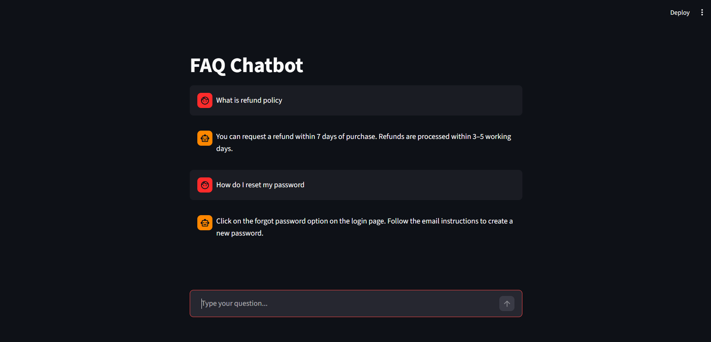

# FAQ Chatbot (NLP + Streamlit)

An intelligent FAQ chatbot built using **Python, NLP, and Streamlit**.  
The chatbot matches user questions with predefined FAQs using **TF-IDF vectorization** and **Cosine Similarity** and responds through a simple chat interface.

## 📸 Chatbot UI

---

# Features

- Chat-style user interface
- FAQ matching using NLP
- TF-IDF vectorization
- Cosine similarity search
- Text file based FAQ dataset
- Streamlit web application
- Modular project structure

---

# Technologies Used

- Python
- Streamlit
- NLTK
- Scikit-learn
- Natural Language Processing (NLP)

---

## 📂 Project Structure

CodeAlpha_FAQChatbot/
│
├── data/                # FAQ dataset
├── src/                 # NLP logic and processing
├── ui/                  # Streamlit UI components
├── images/              # Screenshots
├── app.py               # Main application file
├── requirements.txt     # Dependencies
├── README.md            # Project documentation
└── .gitignore           # Ignored files

