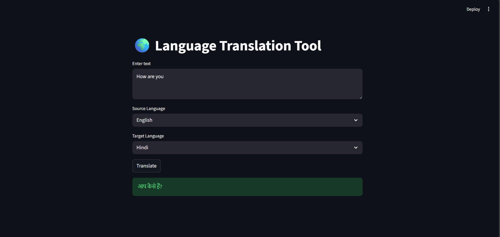

# Language Translation Tool

A simple Language Translation Web Application built using Python and Streamlit.
The application allows users to enter text, select source and target languages, and instantly view the translated output using an online translation service.

This project demonstrates API integration, NLP-based language processing, and interactive UI development.

## 📸 Chatbot UI

# Features

- Simple and user-friendly interface
- Translate text between multiple languages
- Real-time translation using translation API
- Clean Streamlit web interface
- Fast and lightweight applicatio

# Technologies Used

- Python
- Streamlit – for building the web UI
- deep-translator – for language translation
- NLP Concepts – multilingual text processing

# Project Structure

CodeAlpha_TranslatorApp/
│
├── app.py              # Main Streamlit application
├── translator.py       # Translation logic
├── images   
├── README.md
|__ requirements.txt    # Dependencies
└── gitignore 

